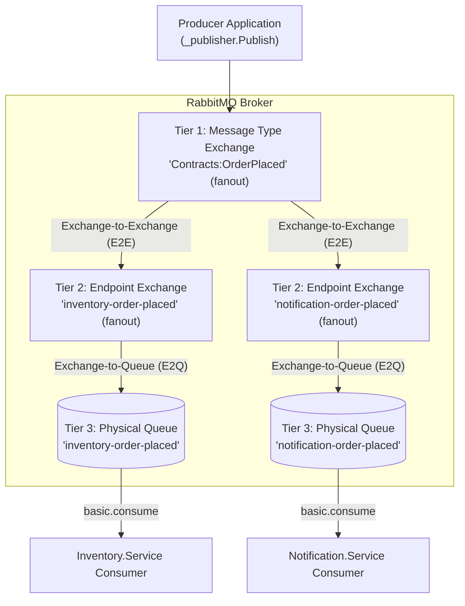
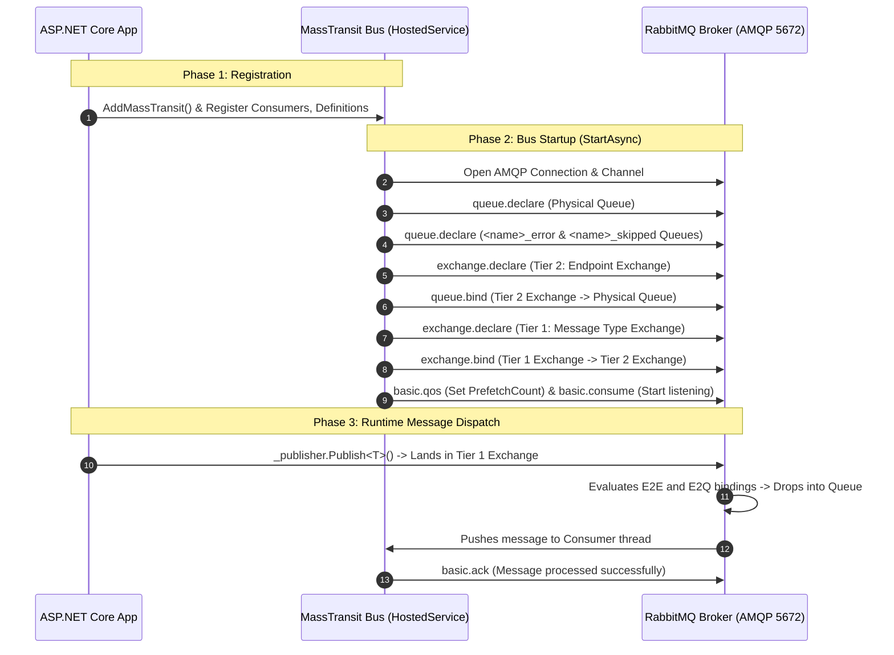

# MassTransit Broker Binding Lifecycle & Two-Tier Exchange Model (English & বাংলা)

This guide documents **the complete lifecycle of how exchanges, queues, and bindings are created in RabbitMQ by MassTransit**, with an in-depth architectural explanation of **why MassTransit uses a Two-Tier Exchange Model (Exchange-to-Exchange / E2E binding)**.

---

## 1. The Core Architecture: Two-Tier Exchange Model (E2E)

In native RabbitMQ, developers typically bind an Exchange directly to a Queue. **MassTransit uses a superior Two-Tier Exchange Model** (Exchange-to-Exchange Binding) to decouple message contracts from physical queue endpoints.

### Mermaid Topology Diagram



---

## 2. Why Do We Need the Two-Tier Model? (Deep Architectural Breakdown)

### The Real-World Analogy: Central Mail Sorting vs. Personal Mailbox
* **Tier 1 (Message Type Exchange)**: The **Central Mail Sorting Hub** (categorized by message type: *"Tax Notices"*, *"Amazon Packages"*, *"Magazines"*).
* **Tier 2 (Endpoint Exchange)**: Your **Apartment Building's Mail Delivery Box** (assigned to *"Apartment 4B"*).
* **Tier 3 (Physical Queue)**: Your **Doorstep Mail Basket** (where all mail for 4B is placed for you to read).

If you receive 3 different types of mail, they are all routed to **Your Apartment Box (Tier 2)** first, and then dropped onto **Your Doorstep (Tier 3)**.

---

### Comparison: Naive 1-Tier vs. MassTransit 2-Tier

```mermaid
flowchart LR
    subgraph Naive 1-Tier Model (Problematic)
        Ex1["Exchange: OrderPlaced"] --> Q1[("Queue: inventory-service")]
        Ex2["Exchange: OrderCancelled"] --> Q1
        Ex3["Exchange: StockRestocked"] --> Q1
    end

    subgraph MassTransit 2-Tier Model (Decoupled & Flexible)
        T1A["Contracts:OrderPlaced"] --> T2["inventory-service (Exchange)"]
        T1B["Contracts:OrderCancelled"] --> T2
        T1C["Contracts:StockRestocked"] --> T2
        T2 --> Q2[("inventory-service (Queue)")]
    end
```

---

### Core Problem 1: C# Polymorphism & Interface Inheritance (The Superpower)
In modern C#, domain events implement interfaces for audit logging, notifications, or security:

```csharp
public interface IAuditLog { }
public interface ICustomerNotification { }

// OrderPlaced implements TWO interfaces:
public record OrderPlaced(int OrderId) : IAuditLog, ICustomerNotification;
```

#### How Two-Tier Handles Polymorphic Routing

```mermaid
flowchart TD
    OrderPlacedPub["Publisher: OrderPlaced"] --> ExOrder["Exchange: Contracts:OrderPlaced"]

    subgraph Polymorphic Exchange Hierarchy (E2E)
        ExOrder -->|"E2E Binding"| ExAudit["Exchange: Contracts:IAuditLog"]
        ExOrder -->|"E2E Binding"| ExNotif["Exchange: Contracts:ICustomerNotification"]
    end

    ExAudit -->|"E2Q"| QueueAudit[("Queue: audit-service")]
    ExNotif -->|"E2Q"| QueueNotif[("Queue: notification-service")]

    QueueAudit --> ConsumerAudit["Audit.Service Consumer"]
    QueueNotif --> ConsumerNotif["Notification.Service Consumer"]
```

* **Outcome**: When `OrderPlaced` is published, RabbitMQ automatically cascades the message to `IAuditLog` and `ICustomerNotification`. The `Audit.Service` consumes `IAuditLog` without ever knowing what `OrderPlaced` is!
* **Without Two-Tier**: The publisher would have to manually duplicate the message and publish it 3 times to 3 different queues.

---

### Core Problem 2: Queue Consolidation (Multiple Message Types into One Queue)
In microservices, you want **one primary queue per service or aggregate root**, NOT 50 different queues for 50 different event types.

* **Why?**
  * Having 50 separate queues requires 50 TCP channels, 50 prefetch buffers, 50 thread pools, and wastes massive RabbitMQ RAM.
  * You lose **message ordering** (e.g., an `OrderUpdated` message arriving on Queue B could finish before `OrderPlaced` on Queue A).
* **With Two-Tier**: 50 message exchanges (Tier 1) bind into 1 Endpoint Exchange (Tier 2), cleanly dropping all events into a single physical queue in exact arrival order.

---

### Core Problem 3: Decoupling Ownership (Producer vs. Consumer)
* **Tier 1 (Message Type Exchange)** is owned by the **Message Contract** (Producer domain).
* **Tier 2 (Endpoint Exchange)** is owned by the **Subscribing Microservice** (Consumer domain).

If the Consumer service redeploys, changes quorum queue parameters, or scales horizontally, it only modifies the Tier 2 $\rightarrow$ Tier 3 queue binding. It never affects the Producer or disruptions other subscribers.

---

### Does Two-Tier Add Performance Latency?
**No, practically zero (microseconds).**
* In RabbitMQ, an **Exchange is NOT a thread, process, or file on disk**.
* An Exchange is merely an **in-memory routing table** (a hash lookup in Erlang memory).
* Routing through 2 exchanges takes **less than 2 to 5 microseconds** because RabbitMQ does not write messages to disk until they land in the physical **Queue** (Tier 3).

---

## 3. Step-by-Step Binding Lifecycle Workflow

Here is the exact sequential timeline that occurs when your application starts up and processes messages:



---

## 4. How Different Exchange Bindings are Configured in Code

### A. Default Automatic Fanout Binding
When you call `cfg.ConfigureEndpoints(context)`:
* **What MassTransit does**:
  1. Inspects the consumer `IConsumer<OrderPlaced>`.
  2. Creates queue: `order-placed`.
  3. Creates exchange: `Contracts:OrderPlaced` (fanout).
  4. Automatically binds `Contracts:OrderPlaced` $\rightarrow$ `order-placed` $\rightarrow$ Queue `order-placed`.
* **Zero manual configuration needed**.

---

### B. Custom Direct Exchange Binding (RoutingKey Match)
To prevent default fanout and bind with an exact routing key:
```csharp
cfg.ReceiveEndpoint("notification-email-queue", e =>
{
    // 1. Turn off default fanout binding for this endpoint
    e.ConfigureConsumeTopology = false;

    // 2. Explicitly bind message type with Direct exchange & RoutingKey
    e.Bind<SendNotificationEvent>(b =>
    {
        b.ExchangeType = ExchangeType.Direct;
        b.RoutingKey = "email";
    });

    e.ConfigureConsumer<EmailNotificationConsumer>(ctx);
});
```

---

### C. Custom Topic Exchange Binding (Pattern Wildcard Matching)
To match routing keys with patterns like `payment.*.failed` or `payment.#`:
```csharp
cfg.ReceiveEndpoint("fraud-detection-queue", e =>
{
    e.ConfigureConsumeTopology = false;

    e.Bind<PaymentProcessedEvent>(b =>
    {
        b.ExchangeType = ExchangeType.Topic;
        b.RoutingKey = "payment.*.failed";
    });

    e.ConfigureConsumer<FraudDetectionConsumer>(ctx);
});
```

---

### D. Custom Headers Exchange Binding (Attribute Matching)
To route based on AMQP message headers:
```csharp
cfg.ReceiveEndpoint("enterprise-document-queue", e =>
{
    e.ConfigureConsumeTopology = false;

    e.Bind<DocumentProcessedEvent>(b =>
    {
        b.ExchangeType = ExchangeType.Headers;
        b.SetBindingArgument("tier", "enterprise");
        b.SetBindingArgument("x-match", "all");
    });

    e.ConfigureConsumer<EnterpriseDocumentConsumer>(ctx);
});
```

---

## 5. বাংলা বিস্তারিত ব্যাখ্যা (In-Depth Explanation in Bangla)

### ১. কেন সরাসরি Exchange থেকে Queue-তে না দিয়ে Two-Tier (E2E) ব্যবহার করা হয়?

1. **পলিমরফিজম বা ইন্টারফেস সাপোর্ট (C# Polymorphism)**:
   * ধরুন আপনার ইভেন্ট `OrderPlaced` দুটি ইন্টারফেস ইমপ্লিমেন্ট করে: `IAuditLog` এবং `ICustomerNotification`।
   * Two-Tier থাকার কারণে MassTransit এক্সচেঞ্জগুলোর মধ্যে একটি হায়ারার্কি (Exchange-to-Exchange) তৈরি করে দেয়। ফলে `OrderPlaced` পাবলিশ করলেই স্বয়ংক্রিয়ভাবে অডিট সার্ভিস এবং নোটিফিকেশন সার্ভিস মেসেজটি পেয়ে যায়। পাবলিশারকে আলাদা করে ৩ বার মেসেজ পাঠাতে হয় না।

2. **একটি সার্ভিসের সব মেসেজ একটি কিউ-তে আনা (Queue Consolidation)**:
   * একটি মাইক্রোসার্ভিস হয়তো ১০ ধরণের ইভেন্ট শুনতে চায় (`OrderPlaced`, `OrderCancelled`, `PaymentFailed` ইত্যাদি)।
   * ১০টি আলাদা কিউ বানালে RabbitMQ-এর মেমোরি ও থ্রেড অপচয় হয় এবং কোন ইভেন্ট আগে আসলো তার ধারাবাহিকতা নষ্ট হয়।
   * Two-Tier ব্যবহারে ১০টি মেসেজ এক্সচেঞ্জ এসে একটি Endpoint Exchange-এ মিলিত হয়, এবং সেখান থেকে একটিমাত্র কিউ-তে জমা হয়।

3. **মালিকানা পৃথকীকরণ (Decoupling Ownership)**:
   * টায়ার ১ মেসেজ এক্সচেঞ্জ হলো মেসেজ কন্ট্রাক্টের মালিকানাধীন।
   * টায়ার ২ এন্ডপয়েন্ট এক্সচেঞ্জ হলো কনজিউমার সার্ভিসের নিজস্ব। ফলে কনজিউমার কিউ-এর সেটিংস পরিবর্তন করলেও মূল মেসেজ এক্সচেঞ্জ কোনোভাবেই ক্ষতিগ্রস্ত হয় না।

4. **পারফরম্যান্স কি স্লো হয়?**:
   * **একদমই না।** RabbitMQ-তে Exchange কোনো ফাইল বা ডিস্ক নয়; এটি শুধুমাত্র মেমোরির ভেতরের একটি রাউটিং টেবিল (Lookup Table)। একটি এক্সচেঞ্জ থেকে আরেকটি এক্সচেঞ্জে মেসেজ যেতে মাত্র কয়েক **মাইক্রোসেকেন্ড** সময় লাগে। মেসেজ ডিস্কে সেভ হয় শুধুমাত্র যখন তা আসল কিউ (Queue)-তে পৌঁছায়।
