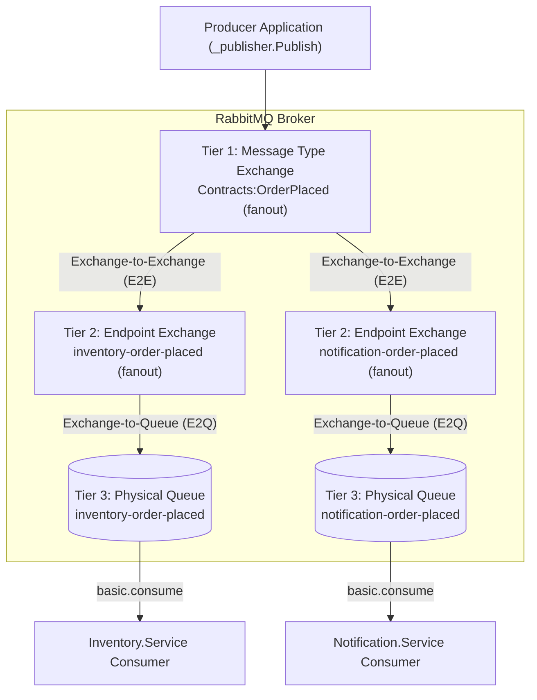
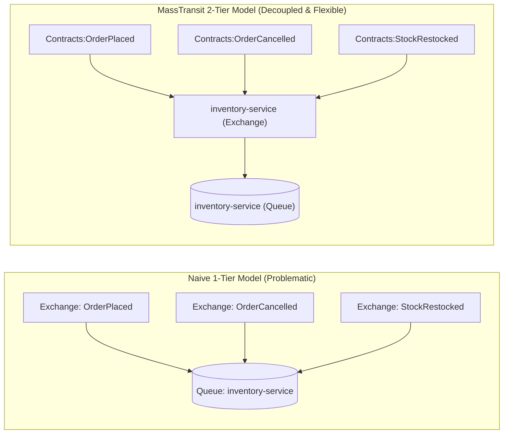
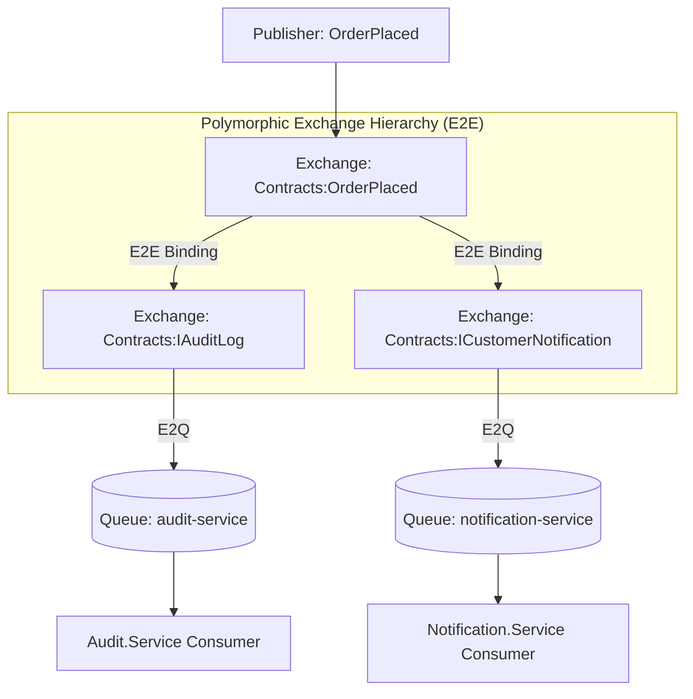
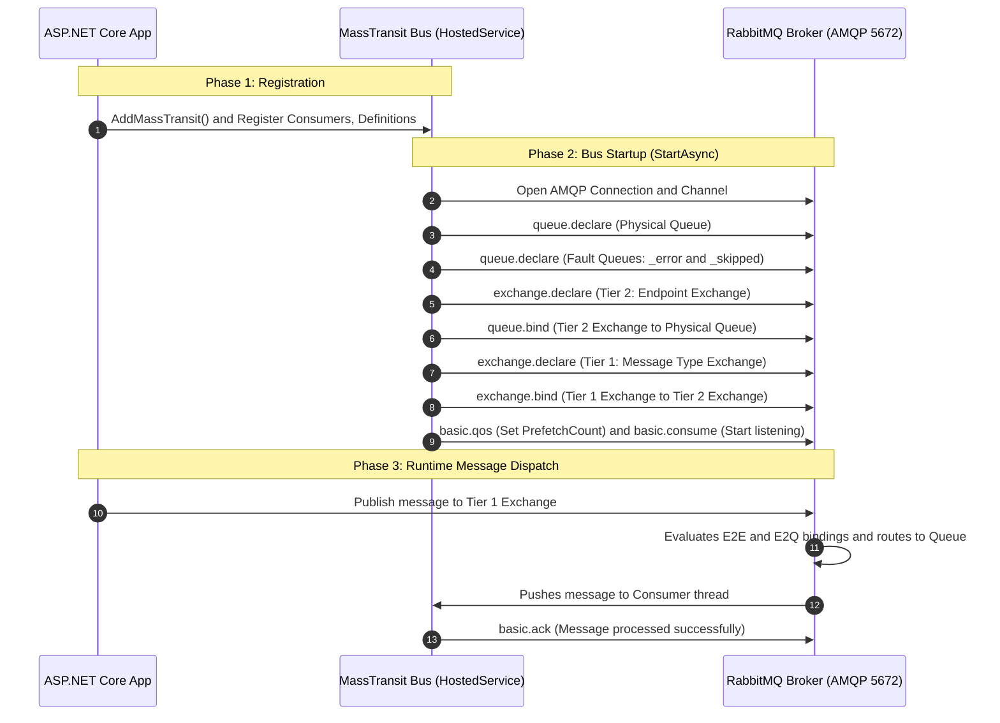

# MassTransit Broker Binding Lifecycle & Two-Tier Exchange Model (English & বাংলা)

This guide documents **the complete lifecycle of how exchanges, queues, and bindings are created in RabbitMQ by MassTransit**, with an in-depth architectural explanation of **why MassTransit uses a Two-Tier Exchange Model (Exchange-to-Exchange / E2E binding)**.

---

## 1. The Core Architecture: Two-Tier Exchange Model (E2E)

### English
In native RabbitMQ, developers typically bind an Exchange directly to a Queue. **MassTransit uses a superior Two-Tier Exchange Model** (Exchange-to-Exchange Binding) to decouple message contracts from physical queue endpoints:
* **Tier 1 (Message Type Exchange)**: Named after the .NET message contract (e.g., `Contracts:OrderPlaced`, type `fanout`).
* **Tier 2 (Endpoint Exchange)**: Named after the receive endpoint / queue (e.g., `inventory-order-placed`, type `fanout`).
* **Tier 3 (Physical Queue)**: Where messages sit before being consumed by the worker thread.

### বাংলা (Bangla)
সাধারণ RabbitMQ কোডে আমরা সরাসরি একটি Exchange-এর সাথে একটি Queue যুক্ত করি। কিন্তু **MassTransit একটি উন্নত টু-টায়ার এক্সচেঞ্জ মডেল (Exchange-to-Exchange)** ব্যবহার করে মেসেজ কন্ট্রাক্টকে ফিজিক্যাল কিউ থেকে সম্পূর্ণ আলাদা করে রাখে:
* **টায়ার ১ (Message Type Exchange)**: C# মেসেজ কন্ট্রাক্টের নামে তৈরি হয় (যেমন: `Contracts:OrderPlaced`, টাইপ `fanout`)।
* **টায়ার ২ (Endpoint Exchange)**: কনজিউমার সার্ভিসের রিসিভ এন্ডপয়েন্ট বা কিউ-এর নামে তৈরি হয় (যেমন: `inventory-order-placed`, টাইপ `fanout`)।
* **টায়ার ৩ (Physical Queue)**: আসল কিউ যেখানে ব্রোকারে মেসেজ জমা থাকে এবং কনজিউমার তা গ্রহণ করে।

### Mermaid Topology Diagram



---

## 2. Why Do We Need the Two-Tier Model? (কেন টু-টায়ার মডেল প্রয়োজন?)

### The Real-World Analogy: Central Mail Sorting vs. Personal Mailbox
#### English
* **Tier 1 (Message Type Exchange)**: The **Central Mail Sorting Hub** (categorized by message type: *"Tax Notices"*, *"Amazon Packages"*, *"Magazines"*).
* **Tier 2 (Endpoint Exchange)**: Your **Apartment Building's Mail Delivery Box** (assigned to *"Apartment 4B"*).
* **Tier 3 (Physical Queue)**: Your **Doorstep Mail Basket** (where all mail for 4B is placed for you to read).
* *Result*: If you receive 3 different types of mail, they are all routed to **Your Apartment Box (Tier 2)** first, and then dropped onto **Your Doorstep (Tier 3)**.

#### বাংলা (Bangla)
* **টায়ার ১ (Message Type Exchange)**: কেন্দ্রীয় ডাক বাছাই কেন্দ্র (যেখানে চিঠির ধরন অনুযায়ী আলাদা করা হয়: *"ব্যাংক নোটিশ"*, *"পার্সেল"*, *"ম্যাগাজিন"*)।
* **টায়ার ২ (Endpoint Exchange)**: আপনার অ্যাপার্টমেন্ট ভবনের সেন্ট্রাল লেটারবক্স (*"ফ্ল্যাট ৪বি"* এর জন্য নির্ধারিত)।
* **টায়ার ৩ (Physical Queue)**: আপনার ফ্ল্যাটের দরজার সামনের ঝুড়ি (যেখান থেকে আপনি সব চিঠি একসাথে সংগ্রহ করেন)।
* *ফলাফল*: ৩ ধরণের ভিন্ন চিঠি আসলে কেন্দ্রীয় কেন্দ্র থেকে সেগুলো প্রথমে আপনার ভবনের বক্সে (টায়ার ২) আসে, এবং সেখান থেকে আপনার দরজার ঝুড়িতে (টায়ার ৩) জমা হয়।

---

### Comparison: Naive 1-Tier vs. MassTransit 2-Tier
#### English
* In the naive 1-tier approach, every message exchange connects directly to the queue. Reconfiguring, deleting, or altering the queue breaks all individual exchange links and fails to support C# polymorphic inheritance.
* In the 2-tier approach, message exchanges connect to the endpoint exchange, decoupling contract definitions from service endpoints.

#### বাংলা (Bangla)
* ১-টায়ার মডেলে প্রতিটি মেসেজ এক্সচেঞ্জ সরাসরি কিউ-তে যুক্ত থাকে। কিউ কোনো কারণে ডিলিট বা পরিবর্তন করলে সবগুলো বাইন্ডিং ভেঙে যায় এবং C# ইন্টারফেস বা পলিমরফিজম কাজ করে না।
* ২-টায়ার মডেলে মেসেজ এক্সচেঞ্জগুলো এন্ডপয়েন্ট এক্সচেঞ্জের সাথে যুক্ত হয়ে একটি সুন্দর লেয়ার তৈরি করে, যা ডিস্ট্রিবিউটেড আর্কিটেকচারে সম্পূর্ণ স্বাধীনতা দেয়।



---

### Core Reason 1: C# Polymorphism & Interface Inheritance (পলিমরফিজম সাপোর্ট)
#### English
In modern C#, domain events implement interfaces for audit logging, notifications, or security:
```csharp
public interface IAuditLog { }
public interface ICustomerNotification { }

// OrderPlaced implements TWO interfaces:
public record OrderPlaced(int OrderId) : IAuditLog, ICustomerNotification;
```
* **How Two-Tier solves this**: MassTransit builds a cascading exchange hierarchy using E2E bindings. When `OrderPlaced` is published, RabbitMQ automatically routes copies to `IAuditLog` and `ICustomerNotification`. The `Audit.Service` consumes `IAuditLog` without needing to know anything about `OrderPlaced`!
* **Without Two-Tier**: The producer would have to know all subscriber interfaces and manually duplicate the message 3 times to 3 different queues.

#### বাংলা (Bangla)
C#-এ আমরা সাধারণত ইভেন্টে ইন্টারফেস ব্যবহার করি (যেমন: অডিট লগিং বা কাস্টমার নোটিফিকেশনের জন্য):
* **টু-টায়ার কীভাবে সমাধান করে**: MassTransit মূল ক্লাসের এক্সচেঞ্জের সাথে ইন্টারফেস এক্সচেঞ্জগুলোর E2E বাইন্ডিং করে দেয়। ফলে `OrderPlaced` পাবলিশ করলেই RabbitMQ স্বয়ংক্রিয়ভাবে অডিট এক্সচেঞ্জ এবং নোটিফিকেশন এক্সচেঞ্জে মেসেজ পাঠিয়ে দেয়। অডিট সার্ভিস শুধু `IAuditLog` ইন্টারফেস জেনেই মেসেজ গ্রহণ করতে পারে।
* **টু-টায়ার ছাড়া কী হতো**: পাবলিশারকে নিজে হাতে ৩টি আলাদা কিউ-তে ৩ বার একই মেসেজ পাঠাতে হতো।



---

### Core Reason 2: Queue Consolidation (সব মেসেজ এক কিউ-তে আনা)
#### English
In microservices, you want **one primary queue per service or aggregate root**, NOT 50 different queues for 50 different event types.
* **Why?** Having 50 separate queues requires 50 TCP channels, 50 prefetch buffers, 50 worker thread pools, and wastes substantial RabbitMQ RAM. You also lose **message ordering** across related events.
* **With Two-Tier**: 50 message exchanges (Tier 1) bind into 1 Endpoint Exchange (Tier 2), cleanly dropping all events into a single physical queue in exact arrival order.

#### বাংলা (Bangla)
একটি মাইক্রোসার্ভিসে সাধারণত **একটি প্রধান কিউ** থাকা উচিত, ৫০টি ইভেন্টের জন্য ৫০টি আলাদা কিউ নয়।
* **কেন?** ৫০টি কিউ তৈরি করলে ৫০টি TCP চ্যানেল, ৫০টি প্রিফেচ বাফার এবং প্রচুর মেমোরি নষ্ট হয়। তাছাড়া ইভেন্টের ধারাবাহিকতা (Order) বজায় থাকে না।
* **টু-টায়ারের সুবিধা**: ৫০টি ভিন্ন ভিন্ন ইভেন্ট এক্সচেঞ্জ এসে একটিমাত্র Endpoint Exchange (Tier 2)-এ মিলিত হয় এবং সেখান থেকে একটিমাত্র কিউ-তে সঠিক ক্রমানুসারে জমা হয়।

---

### Core Reason 3: Decoupling Ownership (মালিকানা পৃথকীকরণ)
#### English
* **Tier 1 (Message Type Exchange)** is owned by the **Message Contract** (Producer domain).
* **Tier 2 (Endpoint Exchange)** is owned by the **Subscribing Microservice** (Consumer domain).
* If the consumer service redeploys, changes quorum queue parameters, or scales horizontally, it only modifies the Tier 2 → Tier 3 queue binding. It never affects the Producer or disrupts other subscribers.

#### বাংলা (Bangla)
* **টায়ার ১ এক্সচেঞ্জ** হলো মেসেজ কন্ট্রাক্ট বা প্রডিউসারের অধীনে।
* **টায়ার ২ এক্সচেঞ্জ** হলো কনজিউমার সার্ভিসের নিজস্ব অধীনে।
* কনজিউমার সার্ভিস যদি নতুন করে ডিপ্লয় হয় বা কিউ-এর সেটিংস পরিবর্তন করে, তবে তা শুধুমাত্র টায়ার ২ থেকে টায়ার ৩-এর মধ্যে সীমাবদ্ধ থাকে। প্রডিউসার বা অন্য কোনো সার্ভিসের কাজে কোনো ব্যাঘাত ঘটে না।

---

### Performance Reality: Does Two-Tier Add Latency? (পারফরম্যান্স কি কমে?)
#### English
**No, practically zero overhead (2 to 5 microseconds).**
* In RabbitMQ, an **Exchange is NOT a thread, process, or file on disk**.
* An Exchange is merely an **in-memory routing table** (a hash lookup in Erlang memory).
* Messages are only written to disk when they enter the physical **Queue (Tier 3)**.

#### বাংলা (Bangla)
**না, পারফরম্যান্সে কোনো প্রভাব নেই (মাত্র ২ থেকে ৫ মাইক্রোসেকেন্ড সময় নেয়)।**
* RabbitMQ-তে Exchange কোনো প্রসেস, থ্রেড বা ডিস্ক ফাইল নয়; এটি কেবল মেমোরিতে থাকা একটি রুট লুকআপ টেবিল (Erlang Hash Table)।
* মেসেজ ডিস্কে সেভ হয় শুধুমাত্র তখনই, যখন তা চূড়ান্ত ফিজিক্যাল কিউ (Tier 3)-তে পৌঁছায়।

---

## 3. Step-by-Step Binding Lifecycle Workflow (লাইফসাইকেল টাইমলাইন)

### English
1. **Registration Phase**: ASP.NET Core registers consumers and endpoint formatters in memory during startup.
2. **Bus Startup Phase (`StartAsync`)**:
   * MassTransit opens an AMQP connection and channel to RabbitMQ.
   * Declares physical queues and fault queues (`_error`, `_skipped`).
   * Declares Tier 2 Endpoint Exchange and binds it to the Queue (`queue.bind`).
   * Declares Tier 1 Message Type Exchange and binds it to Tier 2 (`exchange.bind`).
   * Configures `basic.qos` (PrefetchCount) and begins consuming (`basic.consume`).
3. **Runtime Dispatch Phase**: Publisher sends a message to Tier 1, RabbitMQ evaluates bindings, routes the message to the queue, and the consumer thread processes and acknowledges (`basic.ack`).

### বাংলা (Bangla)
১. **রেজিস্ট্রেশন ধাপ**: অ্যাপ্লিকেশনের শুরুতে মেমোরিতে সব কনজিউমার ও সেটিংস রেজিস্টার হয়।
২. **বাস স্টার্ট ধাপ (`StartAsync`)**:
   * RabbitMQ-এর সাথে কানেকশন ও চ্যানেল ওপেন করে।
   * মূল কিউ এবং এরর কিউ (`_error`, `_skipped`) তৈরি করে।
   * টায়ার ২ এন্ডপয়েন্ট এক্সচেঞ্জ তৈরি করে কিউ-এর সাথে বাইন্ড করে (`queue.bind`)।
   * টায়ার ১ মেসেজ এক্সচেঞ্জ তৈরি করে টায়ার ২-এর সাথে বাইন্ড করে (`exchange.bind`)।
   * প্রিফেচ কাউন্ট সেট করে এবং মেসেজ শোনার জন্য `basic.consume` কল করে।
৩. **রানটাইম মেসেজ পাঠানো ধাপ**: পাবলিশার মেসেজ পাঠালে তা টায়ার ১ এক্সচেঞ্জে আসে, রুলস অনুযায়ী কিউ-তে জমা হয় এবং কনজিউমার প্রসেস শেষ করে `basic.ack` পাঠায়।

### Sequence Diagram



---

## 4. How Different Exchange Bindings are Configured in Code (কোড কনফিগারেশন)

### A. Default Automatic Fanout Binding (ডিফল্ট ফ্যানআউট)
#### English
Calling `cfg.ConfigureEndpoints(context)` automatically inspects the message contract, declares the queue, declares the message exchange (fanout), and links them together via E2E binding without any manual code.

#### বাংলা (Bangla)
`cfg.ConfigureEndpoints(context)` কল করলে MassTransit নিজে থেকেই কনজিউমার দেখে কিউ তৈরি করে, মেসেজের নামে Fanout এক্সচেঞ্জ বানায় এবং সেগুলোকে বাইন্ড করে দেয়। কোনো ম্যানুয়াল কোড লিখতে হয় না।

---

### B. Custom Direct Exchange Binding (ডিরেক্ট এক্সচেঞ্জ)
#### English & বাংলা
```csharp
cfg.ReceiveEndpoint("notification-email-queue", e =>
{
    // Turn off default fanout binding for this endpoint
    // ডিফল্ট ফ্যানআউট বাইন্ডিং বন্ধ করা
    e.ConfigureConsumeTopology = false;

    // Explicitly bind message type with Direct exchange & exact RoutingKey
    // ডিরেক্ট এক্সচেঞ্জ ও নির্দিষ্ট রাউটিং কী দিয়ে বাইন্ড করা
    e.Bind<SendNotificationEvent>(b =>
    {
        b.ExchangeType = ExchangeType.Direct;
        b.RoutingKey = "email";
    });

    e.ConfigureConsumer<EmailNotificationConsumer>(ctx);
});
```

---

### C. Custom Topic Exchange Binding (টপিক এক্সচেঞ্জ)
#### English & বাংলা
```csharp
cfg.ReceiveEndpoint("fraud-detection-queue", e =>
{
    e.ConfigureConsumeTopology = false;

    // Topic exchange wildcard binding (* and #)
    // ওয়াইল্ডকার্ড দিয়ে টপিক এক্সচেঞ্জ বাইন্ডিং
    e.Bind<PaymentProcessedEvent>(b =>
    {
        b.ExchangeType = ExchangeType.Topic;
        b.RoutingKey = "payment.*.failed";
    });

    e.ConfigureConsumer<FraudDetectionConsumer>(ctx);
});
```

---

### D. Custom Headers Exchange Binding (হেডার্স এক্সচেঞ্জ)
#### English & বাংলা
```csharp
cfg.ReceiveEndpoint("enterprise-document-queue", e =>
{
    e.ConfigureConsumeTopology = false;

    // Bind using AMQP message headers (e.g., tier = enterprise)
    // মেসেজের হেডার মেটাডেটা দিয়ে বাইন্ডিং
    e.Bind<DocumentProcessedEvent>(b =>
    {
        b.ExchangeType = ExchangeType.Headers;
        b.SetBindingArgument("tier", "enterprise");
        b.SetBindingArgument("x-match", "all");
    });

    e.ConfigureConsumer<EnterpriseDocumentConsumer>(ctx);
});
```
