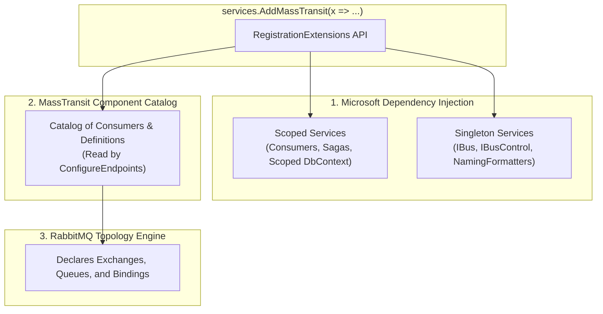

# MassTransit RegistrationExtensions Guide: When, Where & Which One to Use (English & বাংলা)

This guide provides a comprehensive architectural explanation of **MassTransit's `RegistrationExtensions`**, breaking down how registration bridges .NET Dependency Injection with message broker topology, and **which method to choose for different production scenarios**.

---

## 1. What is `RegistrationExtensions`? (পরিচিতি ও কাজের পরিধি)

### English
In MassTransit, `RegistrationExtensions` is the core extension class for `IBusRegistrationConfigurator` (used inside `services.AddMassTransit(x => ...)`). It performs two critical jobs at startup:
1. **Registers components into .NET Dependency Injection (`IServiceCollection`)**:
   * Registers consumers, sagas, and definitions with proper lifetimes (`Scoped` per consumed message).
   * Registers the bus, endpoint formatters, and request clients as `Singleton` or `Scoped`.
2. **Populates MassTransit's Internal Catalog**:
   * Registers metadata that `cfg.ConfigureEndpoints(context)` inspects to automatically declare RabbitMQ exchanges, queues, and bindings.

### বাংলা (Bangla)
MassTransit-এ `RegistrationExtensions` হলো `IBusRegistrationConfigurator`-এর মূল এক্সটেনশন ক্লাস (যা `services.AddMassTransit(x => ...)`-এর ভেতরে ব্যবহৃত হয়)। অ্যাপ্লিকেশন চালুর সময় এটি দুটি কাজ করে:
1. **.NET DI কনটেইনারে সার্ভিস রেজিস্টার করা**:
   * প্রতিটি Consumer এবং Saga-কে সঠিক লাইফটাইমে (`Scoped` - প্রতিটি মেসেজের জন্য আলাদা স্কোপ) রেজিস্টার করে।
   * বাস ও নেইমিং ফরম্যাটারগুলোকে `Singleton` হিসেবে রেজিস্টার করে।
2. **MassTransit-এর মেমোরি ক্যাটালগে যুক্ত করা**:
   * কোন কোন কনজিউমারের জন্য RabbitMQ-তে Exchange ও Queue তৈরি করতে হবে, তা এই ক্যাটালগ থেকেই `cfg.ConfigureEndpoints(context)` বের করে নেয়।

### Architecture Flow Diagram



---

## 2. Consumer Registration Methods (কনজিউমার রেজিস্ট্রেশন মেথডসমূহ)

### A. `AddConsumer<TConsumer>()`
```csharp
x.AddConsumer<OrderPlacedConsumer>();
```
#### English
* **When to use**: Small prototypes, microservices with only 1–2 consumers, or when configuring inline endpoint parameters:
  ```csharp
  x.AddConsumer<OrderPlacedConsumer>(e => e.Endpoint(ep => ep.Name = "custom-order-queue"));
  ```
* **Pros**: Explicit and easy to read for tiny services.
* **Cons**: ⚠️ **Not scalable**. In large projects with 20+ consumers, developers frequently forget to register new consumers in `Startup.cs`, causing silent runtime issues where messages sit unconsumed.

#### বাংলা (Bangla)
* **কখন ব্যবহার করবেন**: খুব ছোট প্রজেক্ট (১–২টি কনজিউমার) বা যখন ইনলাইন কোডে কিউ-এর নাম কাস্টমাইজ করতে হয়।
* **সুবিধা**: ছোট সার্ভিসের জন্য কোড একদম স্পষ্ট।
* **অসুবিধা**: বড় প্রজেক্টে নতুন Consumer ক্লাস তৈরি করার পর `Startup.cs`-এ রেজিস্টার করতে ভুলে যাওয়ার ঝুঁকি থাকে, ফলে মেসেজ কিউ-তে জমা হয়ে থাকে কিন্তু প্রসেস হয় না।

---

### B. `AddConsumers(params Assembly[] assemblies)`
```csharp
x.AddConsumers(typeof(Program).Assembly);
```
#### English
* **When to use**: Standard microservices where **all consumer classes in the assembly belong strictly to this service**. Automatically scans and registers every `IConsumer<T>` and companion `ConsumerDefinition<T>`.
* **Pros**: 100% automated. Adding a new consumer file automatically activates it without touching `Startup.cs`.
* **Cons**: Scans the entire assembly. If you have experimental, deprecated, or test consumers in the assembly, they will be registered and start consuming messages unintentionally.

#### বাংলা (Bangla)
* **কখন ব্যবহার করবেন**: স্ট্যান্ডার্ড মাইক্রোসার্ভিসে যেখানে ওই প্রজেক্টের সব কনজিউমারই সেই সার্ভিসের জন্য প্রযোজ্য।
* **সুবিধা**: সম্পূর্ণ অটোমেটিক। নতুন Consumer ক্লাস লিখলেই কাজ শুরু করে, `Startup.cs` পরিবর্তন করতে হয় না।
* **অসুবিধা**: পুরো অ্যাসেম্বলি স্ক্যান করে; ফলে কোনো পরীক্ষামূলক বা টেস্ট কনজিউমার থাকলে তাও স্বয়ংক্রিয়ভাবে মেসেজ নেওয়া শুরু করে দিতে পারে।

---

### C. `AddConsumersFromNamespaceContaining<TMarker>()` ⭐ *(Recommended Best Practice)*
```csharp
x.AddConsumersFromNamespaceContaining<InventoryStockUpdateConsumer>();
```
#### English
* **When to use**: **Modular Monoliths**, Clean Architecture solutions, or projects where multiple feature folders share an assembly, but only specific consumers belong to this service.
* **Pros**: The senior engineer's choice: combines automatic discovery with strict namespace/domain isolation.
* **Cons**: None for well-structured projects.

#### বাংলা (Bangla)
* **কখন ব্যবহার করবেন**: **মডুলার মনোলিথ** বা ক্লিন আর্কিটেকচার প্রজেক্টে, যেখানে একটি নির্দিষ্ট নেইমস্পেস বা ফোল্ডারের কনজিউমারগুলোকে আলাদা রাখতে হয়।
* **সুবিধা**: সিনিয়র আর্কিটেক্টদের প্রথম পছন্দ। অটোমেটিক স্ক্যানিংয়ের সুবিধা দেয় আবার নির্দিষ্ট ডোমেইনের বাইরে অন্য কনজিউমারকে রেজিস্টার হতে দেয় না।

---

### D. `AddConsumer<TConsumer, TConsumerDefinition>()`
```csharp
x.AddConsumer<InventoryStockUpdateConsumer, InventoryStockUpdateConsumerDefinition>();
```
#### English
* **When to use**: When a consumer requires specialized prefetch limits, retry filters, or dedicated queue names defined in a `ConsumerDefinition<T>`, and you want explicit registration rather than reflection scanning.

#### বাংলা (Bangla)
* **কখন ব্যবহার করবেন**: যখন কোনো নির্দিষ্ট কনজিউমারের জন্য আলাদা রিট্রাই পলিসি বা প্রিফেচ লিমিটসহ `ConsumerDefinition<T>` ক্লাস থাকে এবং আপনি তা সুনির্দিষ্টভাবে রেজিস্টার করতে চান।

---

## 3. Endpoint Naming Formatters (কিউ নেইমিং ফরম্যাটার)

### A. `SetKebabCaseEndpointNameFormatter()`
```csharp
x.SetKebabCaseEndpointNameFormatter();
```
#### English
* **When to use**: The universal standard for RabbitMQ in Docker/Linux environments.
* Converts `OrderPlacedConsumer` → `order-placed` queue.

#### বাংলা (Bangla)
* **কখন ব্যবহার করবেন**: লিনাক্স ও ডকার পরিবেশে RabbitMQ-এর জন্য এটি ইন্ডাস্ট্রি স্ট্যান্ডার্ড।
* ক্লাসের নাম `OrderPlacedConsumer` থাকলে কিউ-এর নাম স্বয়ংক্রিয়ভাবে `order-placed` বানায়।

---

### B. `SetEndpointNameFormatter(new KebabCaseEndpointNameFormatter("prefix", false))`
```csharp
x.SetEndpointNameFormatter(new KebabCaseEndpointNameFormatter("inventory", false));
```
#### English
* **When to use**: When multiple microservices share the same RabbitMQ virtual host (`/`).
* Prefixes all queues with the service domain (e.g., `inventory-order-placed`) to eliminate queue name collisions between services.

#### বাংলা (Bangla)
* **কখন ব্যবহার করবেন**: যখন একাধিক মাইক্রোসার্ভিস একই RabbitMQ ভার্চুয়াল হোস্ট শেয়ার করে।
* প্রতিটি কিউ-এর নামের আগে সার্ভিসের নাম যোগ করে দেয় (যেমন: `inventory-order-placed`), ফলে এক সার্ভিসের কিউ-এর সাথে অন্য সার্ভিসের কিউ-এর নাম কখনো মিলে যায় না।

---

## 4. Advanced Component Registrations (উন্নত কম্পোনেন্ট রেজিস্ট্রেশন)

| Method | Role (ভূমিকা) | Real-World Scenario (বাস্তব ব্যবহার) |
| :--- | :--- | :--- |
| **`AddRequestClient<TRequest>()`** | Registers `IRequestClient<T>` for RPC messaging. | When an API controller needs to query another service over RabbitMQ and await a typed response (e.g., `CheckOrderStatus`). |
| **`AddSagaStateMachine<TMachine, TInstance>()`** | Registers Automatonymous state machines. | Orchestrating long-running workflows with compensation (e.g., Order → Payment → Inventory → Shipping). |
| **`AddSaga<TSaga>()`** | Registers class-based sagas. | Managing state transitions with event correlation identifiers. |
| **`AddExecuteActivity<TActivity, TArgs>()`** | Registers Routing Slip activities. | Multi-step distributed transactions orchestrated through routing slips. |

---

## 5. Quick Decision Matrix (চিটশিট ও সিদ্ধান্ত সহায়িকা)

| Scenario (পরিস্থিতি) | Recommended Method (পছন্দনীয় মেথড) | Rationale (যৌক্তিক কারণ) |
| :--- | :--- | :--- |
| **Small demo / 1–2 consumers** | `AddConsumer<T>()` | Simple, minimal overhead. |
| **Dedicated single-purpose microservice** | `AddConsumers(Assembly)` | Fully automated discovery without touching Startup. |
| **Enterprise / Modular Monolith / Clean Architecture** | `AddConsumersFromNamespaceContaining<T>()` | Automated discovery with strict domain boundary isolation. |
| **Consumer with custom retries & prefetch** | Companion `ConsumerDefinition<T>` | Clean separation of concerns outside Startup. |
| **RPC style request/response over bus** | `AddRequestClient<T>()` | Provides typed `GetResponse<TResponse>()` for APIs. |
| **Production queue naming convention** | `SetKebabCaseEndpointNameFormatter()` | Follows standard kebab-case naming for broker objects. |
| **Shared broker with multiple services** | `SetEndpointNameFormatter(prefix, false)` | Prevents cross-service queue name collisions. |
