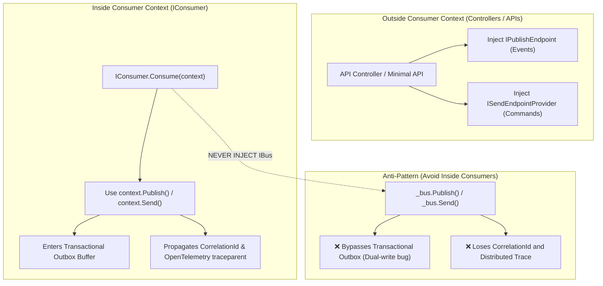

# MassTransit Message Dispatching: Ways of Publishing, Sending & Advanced Patterns (English & বাংলা)

This guide documents **all the different ways to publish, send, and dispatch messages in MassTransit**, explaining when, where, and why to use each interface, along with critical architectural rules regarding the **Transactional Outbox and Distributed Tracing**.

---

## 1. Overview & Comparison Matrix (মেসেজ পাঠানোর পদ্ধতিসমূহ)

| Dispatch Pattern | Core Interface | Semantics | Primary Use Case |
| :--- | :--- | :--- | :--- |
| **Publish (Event)** | `IPublishEndpoint` / `context.Publish` | 1-to-Many (Pub/Sub) | Broadcasting domain events (e.g., `OrderPlaced`) to multiple subscribers. |
| **Send (Command)** | `ISendEndpointProvider` / `EndpointConvention` | 1-to-1 (Point-to-Point) | Direct instruction to a specific queue (e.g., `ProcessPaymentCommand`). |
| **Request / Response** | `IRequestClient<TRequest>` | Synchronous RPC over Bus | Querying a service over messaging and awaiting a typed response. |
| **Scheduling** | `IMessageScheduler` | Delayed / Future Delivery | Executing tasks after a delay (e.g., cart abandonment after 15 mins). |
| **Deferral** | `ConsumeContext.Defer(TimeSpan)` | In-Consumer Delay | Re-delivering a message back to the consumer after a delay. |
| **Routing Slip** | `RoutingSlipBuilder` / `_bus.Execute` | Multi-step Pipeline | Orchestrating distributed activities without a central state machine. |

---

## 2. Ways of Publishing (Events — 1-to-Many / Pub-Sub)

Publishing is used for **Events** (facts that already happened). MassTransit routes them to a Fanout exchange named after the message contract.

### A. `IPublishEndpoint` (Standard for Controllers & Services)
#### English
* **Where to use**: ASP.NET Core API Controllers, Minimal APIs, MediatR handlers, and background services.
* **Characteristics**: Scoped per HTTP request.
```csharp
[ApiController]
[Route("[controller]")]
public class OrdersController : ControllerBase
{
    private readonly IPublishEndpoint _publishEndpoint;

    public OrdersController(IPublishEndpoint publishEndpoint)
    {
        _publishEndpoint = publishEndpoint;
    }

    [HttpPost]
    public async Task<IActionResult> CreateOrder()
    {
        await _publishEndpoint.Publish(new OrderPlaced(101, "Limon"), context =>
        {
            context.SetRoutingKey("eu.orders");
            context.Headers.Set("tenant-id", "tenant-1");
        });
        return Ok();
    }
}
```

#### বাংলা (Bangla)
* **কোথায় ব্যবহার করবেন**: কন্ট্রোলার, Minimal API, বা সাধারণ বিজনেস সার্ভিস ক্লাসে।
* **বৈশিষ্ট্য**: প্রতিটি HTTP রিকোয়েস্টের সাথে Scoped লাইফটাইমে কাজ করে।

---

### B. `ConsumeContext.Publish` ⭐ (Mandatory Inside Consumers)
#### English
* **Where to use**: **Inside any `IConsumer<T>.Consume()` method**.
* **Why it is critical**:
  1. **Correlation Propagation**: Copies `CorrelationId`, `ConversationId`, and `InitiatorId` to outgoing messages.
  2. **Distributed Tracing**: Automatically chains the W3C OpenTelemetry `traceparent` context.
  3. **Transactional Outbox**: Only `context.Publish` participates in the consumer's transactional inbox/outbox buffer!
```csharp
public class OrderPlacedConsumer : IConsumer<OrderPlaced>
{
    public async Task Consume(ConsumeContext<OrderPlaced> context)
    {
        // ALWAYS use context.Publish inside a consumer!
        await context.Publish(new InventoryReserved(context.Message.OrderId));
    }
}
```

#### বাংলা (Bangla)
* **কোথায় ব্যবহার করবেন**: **যেকোনো Consumer-এর ভেতরে**।
* **কেন এটি বাধ্যতামূলক**:
  1. **ট্রেসিং ও কোরিলেশন**: পূর্বের মেসেজের `CorrelationId` ও OpenTelemetry ট্রেস স্বয়ংক্রিয়ভাবে নতুন মেসেজে কপি করে দেয়।
  2. **Transactional Outbox**: কনজিউমারের ভেতরে ডাটাবেজ ট্রানজেকশনের সাথে মেসেজ পাঠাতে হলে অবশ্যই `context.Publish` ব্যবহার করতে হবে।

---

### C. `IBus.Publish` (Root Bus Level)
#### English
* **Where to use**: Application-level lifecycle events (e.g., inside `IHostedService` on app startup/shutdown).
* ⚠️ **Warning**: Never inject `IBus` inside a consumer to publish messages, as it bypasses the Outbox transaction and correlation tracking.

#### বাংলা (Bangla)
* **কোথায় ব্যবহার করবেন**: অ্যাপ্লিকেশন স্টার্টআপ বা শাটডাউনের মতো গ্লোবাল ইভেন্টে।
* ⚠️ **সতর্কতা**: কনজিউমারের ভেতরে কখনো `IBus` ইনজেক্ট করবেন না; এতে Outbox ও ট্রানজেকশন বাইপাস হয়ে যায়।

---

### D. Batch Publishing (`PublishBatch`)
#### English
* **Where to use**: Bulk data imports, CSV processing, or high-throughput sync pipelines.
```csharp
var events = orders.Select(o => new OrderPlaced(o.Id, o.Name));
await _publishEndpoint.PublishBatch(events);
```

#### বাংলা (Bangla)
* **কোথায় ব্যবহার করবেন**: যখন একসাথে শত শত বা হাজার হাজার মেসেজ পাঠাতে হয় (যেমন বাল্ক সিঙ্ক বা CSV ইমপোর্ট)। এতে পাইপলাইনের থ্রুপুট বহুগুণ বাড়ে।

---

## 3. Ways of Sending (Commands — 1-to-1 / Point-to-Point)

Sending is used for **Commands** (direct instructions to a single target queue).

### A. `ISendEndpointProvider` with Explicit Queue URI
#### English
* **Where to use**: When sending commands to a dynamically calculated queue address at runtime.
```csharp
var sendEndpoint = await _sendEndpointProvider.GetSendEndpoint(new Uri("queue:process-payment"));
await sendEndpoint.Send(new ProcessPaymentCommand(101, 50.0m));
```

#### বাংলা (Bangla)
* **কোথায় ব্যবহার করবেন**: যখন রানটাইমে কোনো নির্দিষ্ট কিউ-এর ঠিকানায় সরাসরি কমান্ড পাঠাতে হয়।

---

### B. Endpoint Conventions (`EndpointConvention.Map<T>`) ⭐ (Clean Architecture)
#### English
* **Where to use**: Enterprise projects where queue URIs should not be hardcoded across controllers or domain services. Map the command once at startup, and dispatch cleanly anywhere.

**At Startup (`Program.cs` / `Startup.cs`):**
```csharp
EndpointConvention.Map<ProcessPaymentCommand>(new Uri("queue:process-payment"));
EndpointConvention.Map<SendEmailCommand>(new Uri("queue:notification-email"));
```

**In Controller or Service:**
```csharp
// MassTransit automatically looks up the destination queue from EndpointConvention!
await _sendEndpointProvider.Send(new ProcessPaymentCommand(101, 50.0m));
```

#### বাংলা (Bangla)
* **কোথায় ব্যবহার করবেন**: ক্লিন আর্কিটেকচার অনুযায়ী কোডের ভেতরে হার্ডকোডেড কিউ URI না রেখে অ্যাপ স্টার্টআপে একবার ম্যাপ করে রাখা। এরপর সরাসরি `_sendEndpointProvider.Send(command)` কল করলেই নির্দিষ্ট কিউ-তে চলে যায়।

---

### C. `ConsumeContext.Send` (Inside Consumers)
#### English
```csharp
public async Task Consume(ConsumeContext<OrderPlaced> context)
{
    var sendEndpoint = await context.GetSendEndpoint(new Uri("queue:ship-order"));
    await sendEndpoint.Send(new ShipOrderCommand(context.Message.OrderId));
}
```
* **Where to use**: Sending commands from a consumer to another service while preserving correlation headers.

---

## 4. Advanced Dispatch Patterns ("And Others")

### A. Request/Response RPC (`IRequestClient<T>`)
#### English & বাংলা
Allows synchronous-style request/response over an asynchronous message broker:
```csharp
// 1. Client initiates request and awaits response:
var response = await _requestClient.GetResponse<OrderStatusResult>(new CheckOrderStatus(101));
Console.WriteLine(response.Message.StatusText);

// 2. Consumer responds:
public class CheckOrderStatusConsumer : IConsumer<CheckOrderStatus>
{
    public async Task Consume(ConsumeContext<CheckOrderStatus> context)
    {
        await context.RespondAsync(new OrderStatusResult(101, 1, "Shipped"));
    }
}
```

---

### B. Message Scheduling / Delayed Messages (`IMessageScheduler`)
#### English & বাংলা
Schedule messages for delayed execution (via RabbitMQ Delayed Exchange Plugin or Quartz/Hangfire):
```csharp
// Schedule a publish after 15 minutes:
await _scheduler.SchedulePublish(TimeSpan.FromMinutes(15), new CheckCartAbandonment(cartId));

// Schedule a targeted send in 2 hours:
await _scheduler.ScheduleSend(new Uri("queue:payment-reminder"), DateTime.UtcNow.AddHours(2), new SendReminder(userId));
```

---

### C. Consumer Deferral (`context.Defer`)
#### English & বাংলা
If a consumer receives a message but a dependency is temporarily not ready:
```csharp
if (!isUserAccountActivated)
{
    // Re-delivers the message back to this consumer after 30 seconds:
    await context.Defer(TimeSpan.FromSeconds(30));
    return;
}
```

---

### D. Routing Slips (`RoutingSlipBuilder`)
#### English & বাংলা
Orchestrates multi-step distributed activities across services without a centralized state machine:
```csharp
var builder = new RoutingSlipBuilder(Guid.NewGuid());
builder.AddActivity("ReserveStock", new Uri("queue:reserve-stock-activity"), new { OrderId = 101 });
builder.AddActivity("ChargeCard", new Uri("queue:charge-card-activity"), new { Amount = 100.0m });

var routingSlip = builder.Build();
await _bus.Execute(routingSlip);
```

---

## 5. The Golden Rule: Inside vs. Outside Consumer Context



---

## 6. বাংলা সারসংক্ষেপ ও ইন্টারভিউ গাইড (Bangla Summary & Interview Guide)

1. **ইভেন্ট পাবলিশ করার ক্ষেত্রে**:
   * কন্ট্রোলারে `IPublishEndpoint.Publish()` ব্যবহার করবেন।
   * কনজিউমারের ভেতরে সবসময় `context.Publish()` ব্যবহার করবেন। ভুলেও `_bus.Publish()` কল করবেন না।
2. **কমান্ড পাঠানোর ক্ষেত্রে**:
   * পরিষ্কার আর্কিটেকচারের জন্য `EndpointConvention.Map<T>()` ব্যবহার করে `_sendEndpointProvider.Send(command)` কল করা সবচেয়ে আধুনিক পদ্ধতি।
3. **অন্যান্য প্যাটার্ন**:
   * **RPC (Request/Response)**: `IRequestClient<T>` এবং `context.RespondAsync`।
   * **শিডিউলিং (Scheduling)**: `_scheduler.SchedulePublish(delay, msg)`।
   * **বিলম্বিত করা (Defer)**: কনজিউমারে কাজ আটকে থাকলে `context.Defer(TimeSpan)` দিয়ে কিছু সময় পর আবার রি-ডেলিভারি করানো।
