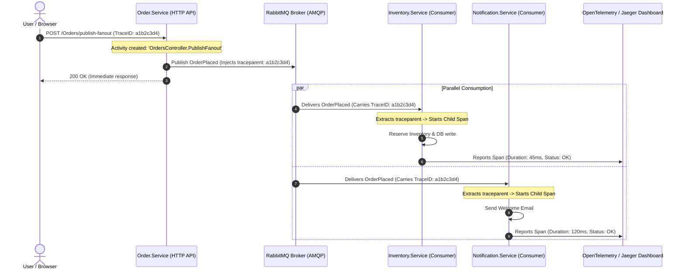
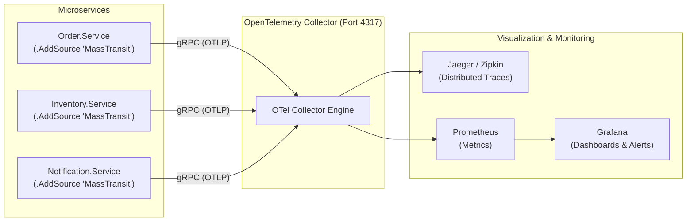

# OpenTelemetry Distributed Tracing & Metrics in MassTransit (English & বাংলা)

This guide documents **why OpenTelemetry is critical for event-driven microservices, how MassTransit natively implements it, and the complete production implementation pattern** in .NET 6.

---

## 1. The "Why": Why do we need OpenTelemetry in Message Brokers?

### English
In traditional synchronous REST architectures, a request travels sequentially from Client → Service A → Service B, making logging relatively straightforward.

In an **event-driven architecture with RabbitMQ**, execution is decoupled and asynchronous:
1. `Order.Service` publishes `OrderPlaced` and immediately returns HTTP 200 to the client.
2. Seconds or minutes later, `Inventory.Service` and `Notification.Service` consume the message.
3. If `Inventory.Service` crashes or encounters a 10-second database lock, **how do you connect that failure back to the original user's HTTP request?**

Without distributed tracing:
* Logs are scattered across multiple container consoles.
* You cannot measure queue latency vs. consumer processing time.
* Root-cause analysis across microservice boundaries becomes nearly impossible.

**OpenTelemetry (OTel)** solves this by creating a unified **Trace ID** that travels from the HTTP endpoint, through RabbitMQ message headers, and down to each background consumer worker.

### বাংলা (Bangla)
সাধারণ REST এপিআই-তে একটি রিকোয়েস্ট এক সার্ভিস থেকে অন্য সার্ভিসে সরাসরি যায়, তাই লগ ট্র্যাক করা সহজ।

কিন্তু **RabbitMQ ভিত্তিক মাইক্রোসার্ভিসে** কাজগুলো অ্যাসিঙ্ক্রোনাসভাবে ঘটে:
১. `Order.Service` মেসেজ পাবলিশ করেই ইউজারকে HTTP 200 রেসপন্স দিয়ে দেয়।
২. এর কিছুক্ষণ পর `Inventory.Service` এবং `Notification.Service` ব্যাকগ্রাউন্ডে মেসেজটি প্রসেস করে।
৩. যদি ইনভেন্টরি সার্ভিসে ডাটাবেজ ফেইল করে বা ১০ সেকেন্ড লেটেন্সি তৈরি হয়, **আপনি কীভাবে বুঝবেন এটি কোন ইউজারের কোন রিকোয়েস্টের কারণে হয়েছে?**

ডিস্ট্রিবিউটেড ট্রেসিং ছাড়া:
* সার্ভিসের লগগুলো বিভিন্ন ডকার কনটেইনারে ছড়িয়ে ছিটিয়ে থাকে।
* মেসেজটি কিউ-তে কতক্ষণ আটকে ছিল আর কনজিউমার কোডে কতক্ষণ সময় লেগেছে তা বের করা যায় না।

**OpenTelemetry** এই সমস্যার সমাধান করে একটি গ্লোবাল **Trace ID** তৈরি করার মাধ্যমে, যা ইউজারের HTTP রিকোয়েস্ট থেকে শুরু করে RabbitMQ মেসেজের হেডারের ভেতর দিয়ে প্রতিটি কনজিউমারে ছড়িয়ে পড়ে।

---

## 2. How MassTransit Implements OpenTelemetry Under the Hood

### English
MassTransit has native, built-in OpenTelemetry instrumentation using the .NET `ActivitySource` named `"MassTransit"`.

* **On `Publish` / `Send`**:
  * MassTransit starts a new Span (Activity).
  * Injects the W3C distributed trace context (`traceparent` and `tracestate`) directly into the AMQP message headers.
* **On `Consume`**:
  * MassTransit extracts the `traceparent` header from RabbitMQ.
  * Starts a child Span connected to the producer's parent span.
  * Adds semantic tags: `messaging.system = rabbitmq`, `messaging.destination = order-placed`, `messaging.message_id`.

### বাংলা (Bangla)
MassTransit-এ আলাদা কোনো কোড ছাড়াই .NET-এর অফিসিয়াল `ActivitySource` (নাম: `"MassTransit"`) ইন্টিগ্রেট করা থাকে।
* যখন মেসেজ **পাবলিশ** হয়: MassTransit একটি স্প্যান তৈরি করে এবং W3C ফরম্যাটে `traceparent` হেডার RabbitMQ মেসেজের সাথে জুড়ে দেয়।
* যখন মেসেজ **কনজিউম** হয়: কনজিউমার ওই হেডারটি রিড করে একটি চাইল্ড স্প্যান (Child Span) তৈরি করে। ফলে Jaeger বা Zipkin ড্যাশবোর্ডে পুরো জার্নিটি একটি গাছের মতো (Trace Tree) দেখা যায়।

### Distributed Trace Flow (Mermaid Diagram)



---

## 3. Production Implementation Pattern in .NET 6

### Step 1: Install NuGet Packages
```bash
dotnet add package OpenTelemetry.Extensions.Hosting
dotnet add package OpenTelemetry.Instrumentation.AspNetCore
dotnet add package OpenTelemetry.Instrumentation.Http
dotnet add package OpenTelemetry.Exporter.OpenTelemetryProtocol
```

---

### Step 2: Configure OpenTelemetry in `Startup.cs` / `Program.cs`

#### English & বাংলা
```csharp
using OpenTelemetry.Resources;
using OpenTelemetry.Trace;
using OpenTelemetry.Metrics;

public void ConfigureServices(IServiceCollection services)
{
    services.AddControllers();

    // 1. Configure OpenTelemetry Tracing & Metrics
    services.AddOpenTelemetry()
        .ConfigureResource(resource => resource
            .AddService(serviceName: "Order.Service", serviceVersion: "1.0.0"))
        .WithTracing(tracing =>
        {
            tracing
                .AddAspNetCoreInstrumentation() // Traces incoming HTTP calls
                .AddHttpClientInstrumentation() // Traces outgoing HTTP calls
                .AddSource("MassTransit")       // ⭐ CRITICAL: Traces all MassTransit messages!
                .AddOtlpExporter(opt =>
                {
                    // Sends traces to OpenTelemetry Collector or Jaeger
                    opt.Endpoint = new Uri("http://localhost:4317");
                });
        })
        .WithMetrics(metrics =>
        {
            metrics
                .AddAspNetCoreInstrumentation()
                .AddMeter("MassTransit")        // ⭐ CRITICAL: Collects MassTransit bus metrics!
                .AddOtlpExporter(opt =>
                {
                    opt.Endpoint = new Uri("http://localhost:4317");
                });
        });

    // 2. Configure MassTransit as usual
    services.AddMassTransit(x =>
    {
        x.SetKebabCaseEndpointNameFormatter();
        x.AddConsumers(typeof(Startup).Assembly);
        x.UsingRabbitMq((context, cfg) =>
        {
            cfg.Host("localhost", "/", c => { ... });
            cfg.ConfigureEndpoints(context);
        });
    });
}
```

> [!IMPORTANT]
> The single line **`.AddSource("MassTransit")`** is what tells the OpenTelemetry SDK to listen to MassTransit's internal activities. Without this line, HTTP traces will work, but message broker events will be completely invisible!

---

## 4. Key Metrics Provided by MassTransit (`AddMeter("MassTransit")`)

| Metric Name | Type | Description (বিবরণ) |
| :--- | :--- | :--- |
| **`masstransit.receive.duration`** | Histogram | Time spent actively processing a message in consumers. |
| **`masstransit.receive.total`** | Counter | Total number of messages received and consumed. |
| **`masstransit.receive.fault`** | Counter | Total number of consumer exceptions and failed messages. |
| **`masstransit.send.duration`** | Histogram | Time required to serialize and push a message to RabbitMQ. |

---

## 5. End-to-End Observability Architecture



---

## 6. বাংলা সারসংক্ষেপ (Bangla Summary)

1. **কেন OpenTelemetry লাগবে?**:
   * মাইক্রোসার্ভিসে মেসেজ পাবলিশ করার পর ইউজারের রিকোয়েস্ট শেষ হয়ে যায়। এরপর ব্যাকগ্রাউন্ডে ইনভেন্টরি বা নোটিফিকেশন সার্ভিসে কোনো এরর হলে বা সিস্টেম স্লো হলে তা ট্র্যাক করার একমাত্র উপায় হলো OpenTelemetry-এর ডিস্ট্রিবিউটেড ট্রেসিং।
2. **MassTransit কীভাবে কাজ করে?**:
   * MassTransit-এর নিজস্ব `ActivitySource` আছে। মেসেজ পাবলিশ করার সময় এটি মেসেজের হেডারে W3C `traceparent` (TraceID) ইনজেক্ট করে দেয়। কনজিউমার সেই আইডি দিয়ে চাইল্ড স্প্যান তৈরি করে।
3. **কীভাবে কোডে যুক্ত করবেন?**:
   * `services.AddOpenTelemetry().WithTracing(b => b.AddSource("MassTransit"))`।
   * **মনে রাখবেন**: `.AddSource("MassTransit")` লাইনটি না দিলে MassTransit-এর কোনো মেসেজ ট্রেস Jaeger বা OTel কালেক্টরে দেখা যাবে না।
